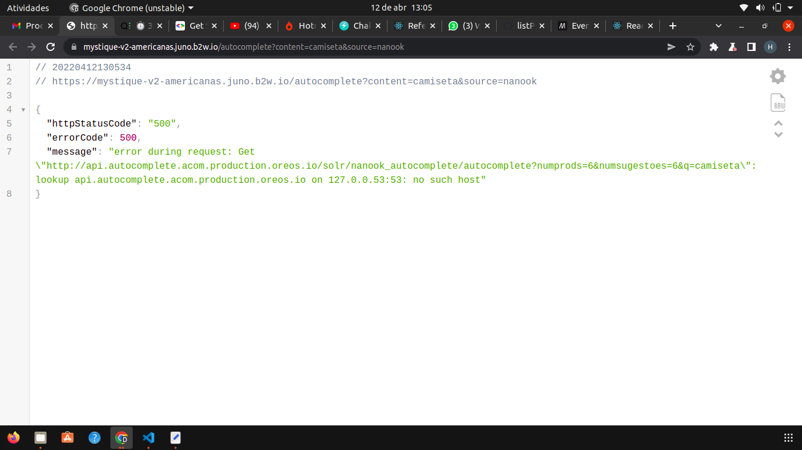

<br />
<p align="center">

  <h3 align="center">Lista de Produtos</h3>
 <br />
  <p align="center">
     Sumário
      <p align="center">
  <a href="#projeto-e-espectativas"> Projeto e Espectativas </a> |
  <a href="#erro"> Erro </a> |
  <a href="#conhecimentos-praticados"> Conhecimentos praticados </a> |
  <a href="#rodando-o-projeto"> Rodando o projeto </a> |
  <a href="#tecnologias-utilizadas"> Tecnologias utilizadas </a>      
       <br />
    <br />
    <h1 align="center">
 </h1>
  </p>
</p>


# Projeto e Espectativas
O objetivo do projeto é criar um input capaz de encontrar produtos disponiveis na [API](https://mystique-v2-americanas.juno.b2w.io/autocomplete?content=camiseta&source=nanook) disponibilizada pela [Calindra](https://calindra.tech/), utilizando palavras chaves e um botão de buscar retornando uma lista de produtos com descrição de ***nome, score e visualizão por click***


# Erro
*Durante o desenvolvimento a [API](https://mystique-v2-americanas.juno.b2w.io/autocomplete?content=camiseta&source=nanook) parou de funcionar e apresentou o status 500 como demonstrado na imagem abaixo.* Se ainda estiver com este problema não será possivel testar o projeto porém a imagem acima foi tirada antes do problema e ela demonstra o projeto funcionando normalmente.



# Conhecimentos Praticados
✔ ReactJS<br>
✔ Chakra <br>
✔ Axios <br>
✔ npm <br>
 
# Rodando o projeto:

### Pré-requisitos:
Antes de começar, você precisará instalar em sua máquina as seguintes ferramentas:
[Git](https://git-scm.com) e [Node.js](https://nodejs.org/en/)<br> Além disso, é aconselhável ter um editor como o [VSCode](https://code.visualstudio.com/) para trabalhar com o código!

### Instalando e rodando o projeto:


```bash
# Clone este repositório
$ git clone https://github.com/henriqueferrazo/listProdutos.git

# Acesse a pasta do projeto no terminal
$ cd my-teste

# Instale as dependências do projeto
$ npm install

# Inicie o servidor da aplicação
$ npm start


```


# Tecnologia utilizada: 
<p align="center">
<a href="https://pt-br.reactjs.org/"></a>
</p>


---
**Desenvolvido por <a href="https://www.linkedin.com/in/henrique-ferraz-a46123219/"> Henrique Ferraz </a>.**
